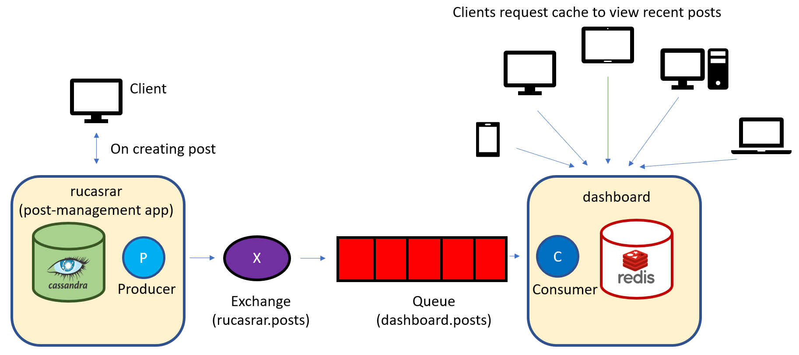

# rucasrar-event-manager

Simple event sourcing with RabbitMQ, Redis, Cassandra

## Utilized:

- Framework: Rails
- NoSQL database for the post-management app: Cassandra
- Message-broker: RabbitMQ
- Cache: Redis

## Features:

* User can publish a post and perform CRUD operation using rucasrar (post-management app)
* On creation of posts, it is queued via RabbitMQ and sent to dashboard app
* Users can view the recent posts from the cache (Redis) of the dashboard 



##### Start the applications running:

```bash
./run.sh
```

##### Open the applications in browser:

- [rucasrar(http://localhost:5001)](http://localhost:5001)
- [dashboard (http://localhost:5002)](http://localhost:5002)

## References:

- [RabbitMQ Tutorials](https://www.rabbitmq.com/getstarted.html)
- [monterail/rails-event-sourcing-example](https://github.com/monterail/rails-event-sourcing-example)

## License:

This repository is released under the [MIT License](http://www.opensource.org/licenses/MIT).
